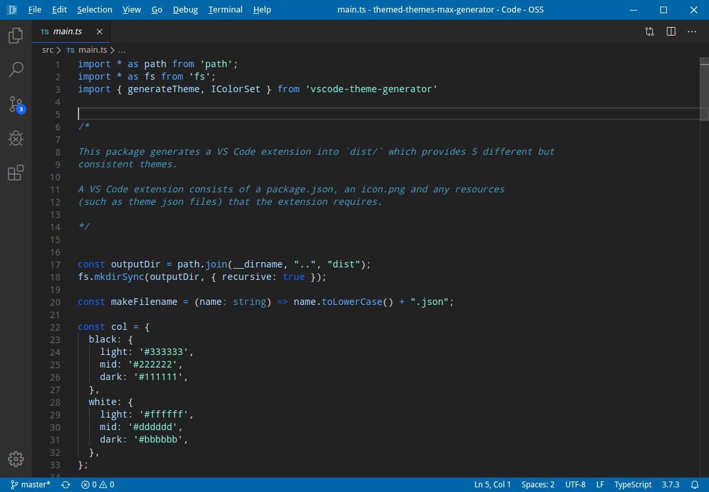
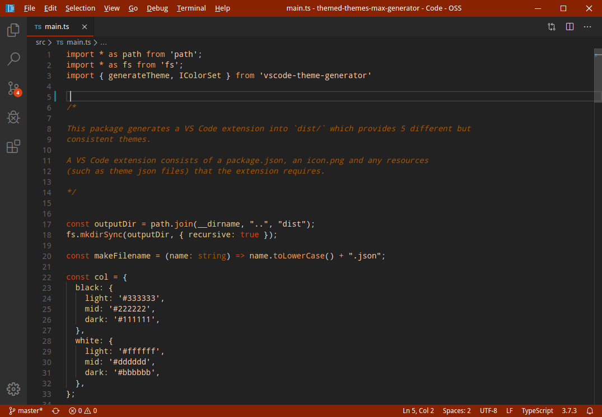

A set of colour-coordinated themes. I made this so that I can use different themes for different workspaces, but still have them look consistent.

There are 5 themes.

## Magic

## Marine

## Meadow

## Molten

## Moonlight

